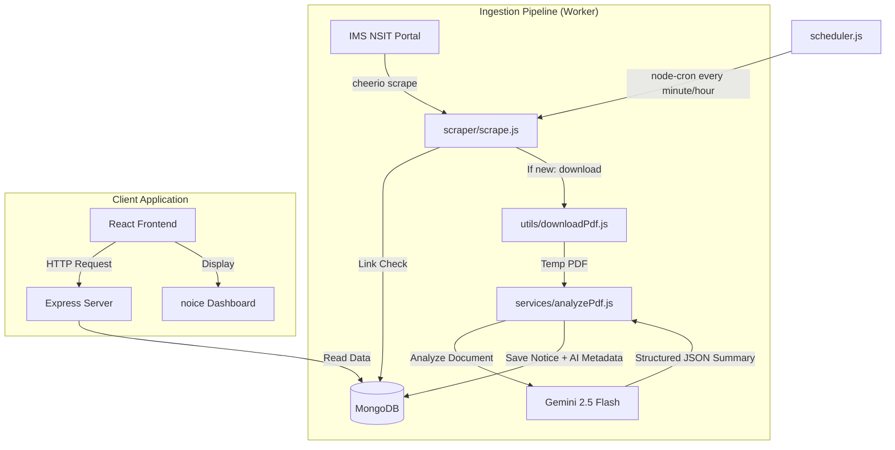

# 🌟 noice. — AI-Powered University Notice Assistant

[](https://vitejs.dev/)
[](https://reactjs.org/)
[](https://nodejs.org/)
[](https://www.mongodb.com/)
[](https://ai.google.dev/)
[](https://tailwindcss.com/)

**noice.** is a premium, real-time web application designed to automatically ingest, scrape, summarize, and categorize university notifications from the IMS NSIT portal. Using the state-of-the-art **Google Gemini 2.5 Flash** model, it reads dense notification PDFs and converts them into structured summaries, extraction grids of important dates/deadlines, action items, and priority ratings. 

---

## 🎨 Design & Aesthetic Highlights
* **Typography:** Elegant type pairing of editorial serif headings (**Playfair Display**) and clean, high-legibility geometric sans-serif UI elements (**Plus Jakarta Sans**).
* **UI/UX:** Modern dashboard interface with glassmorphism navbar panels, card hover transformations, clean category pills, statistics overview counters, and responsive pagination.
* **Smart Sorting:** Filter notices dynamically by category, search keywords, or sort criteria (Date vs. Priority high-to-low).

---

## 🚀 Key Features

* **Automated Data Pipeline:** A cron-based background scheduler continuously checks for new notices without duplicating existing records.
* **Intelligent AI Ingestion:** Automatically downloads notice documents (PDFs), processes them via Google Generative AI, and extracts structural metadata.
* **Structural JSON Outputs:** Prompts Gemini to return precise, validated JSON mapping summaries, categories, priorities, deadlines, and student checklists.
* **API Rate-Limit Awareness:** Handles API quota limits (429 errors) gracefully by stopping the current ingestion loop and resuming from where it left off on the next run.
* **Dynamic Search & Filters:** Instantly search through summaries, titles, and publishers, filter by categories, and isolate High Priority alerts.

---

## 📐 Architecture & Data Flow

Below is the conceptual layout of the **noice.** system architecture:



### Detailed Pipeline Stages:
1. **Scraping (`scraper/scrape.js`):** Parses the HTML table on the IMS NSIT notification board using `axios` and `cheerio`.
2. **Duplication Filter:** Collects all published notice URLs and matches them against existing items in MongoDB. Already parsed entries are skipped.
3. **Downloader (`utils/downloadPdf.js`):** Downloads the attachment PDF locally to a temporary location.
4. **AI Processor (`services/analyzePdf.js`):** Reads the PDF, encodes it to Base64, and prompts the `gemini-2.5-flash` model with schema constraints to output structured JSON content.
5. **Database Sync:** Creates a MongoDB document in the `notices` collection containing both the original scrape details (title, publisher, original link, date) and the extracted AI data.
6. **Graceful Quota Handling:** If the Gemini API hits a daily quota or rate limit, the loop exits safely, saving all successful insertions and leaving the rest for future cron intervals.

---

## 💻 Tech Stack

### Frontend
* **Core:** React 19 (Functional Components, Hook State)
* **Build System:** Vite
* **Styling:** Tailwind CSS v4 (incorporating modern `@theme` custom properties)
* **Fonts:** Playfair Display, Plus Jakarta Sans (Google Fonts)
* **Routing:** React Router v7

### Backend & Ingestion
* **Runtime:** Node.js
* **Framework:** Express (serving REST endpoints `/notices`, `/latest`, and `/notice/:id`)
* **Scraper:** Axios, Cheerio
* **Scheduler:** Node-Cron
* **Database Client:** Mongoose / MongoDB Native Driver
* **AI Integration:** `@google/generative-ai` (Gemini SDK)

---

## 📂 Project Structure

```text
noice/
├── config/              # Database connection setup
├── models/              # Mongoose schema definitions (Notice.js)
├── scraper/             # Web scraping modules (scrape.js)
├── services/            # AI analysis services (analyzePdf.js, gemini.js)
├── utils/               # PDF downloader and helper services
├── logs/                # Failure logs and diagnostic errors
├── temp/                # Temporarily downloaded notice PDFs
├── scheduler.js         # Cron job runner to automate scraping
├── server.js            # Express API server entry point
├── package.json         # Backend node dependencies
└── frontend/            # React Client Application
    ├── public/          # Static assets
    ├── src/
    │   ├── components/  # Reusable UI widgets (Navbar, Card, SearchBar)
    │   ├── pages/       # Home Dashboard and Notice Details view
    │   ├── services/    # Client API fetch wrapper (noticeApi.js)
    │   ├── index.css    # Tailwind CSS V4 imports & font configurations
    │   └── main.jsx     # Frontend mount point
    ├── index.html       # Entry template & Google Fonts imports
    ├── vite.config.js   # Vite development settings
    └── package.json     # Frontend dependencies
```

---

## 🔧 Installation & Setup

### Prerequisites
* **Node.js** (v18+ recommended)
* **MongoDB** (Local instance or Atlas cloud cluster URI)
* **Google Gemini API Key** (Obtained from [Google AI Studio](https://aistudio.google.com/))

### Step 1: Clone and Configure Environment
Create a `.env` file in the root directory:

```env
MONGO_URI=mongodb://localhost:27017/noice
GEMINI_API_KEY=your_gemini_api_key_here
PORT=5000
```

### Step 2: Install Dependencies
Install packages in the root directory as well as the frontend folder:

```bash
# Install root (Backend & Ingestion) dependencies
npm install

# Install client (Frontend) dependencies
cd frontend
npm install
cd ..
```

---

## 🏃 Running the Application

To run the complete system, keep three terminal processes active:

### 1. Start Backend API
Launches the Express server on [http://localhost:5000](http://localhost:5000)
```bash
node server.js
```

### 2. Start Frontend Dev Client
Launches the Vite dev server on [http://localhost:5173](http://localhost:5173)
```bash
cd frontend
npm run dev
```

### 3. Start Scraper Scheduler (Cron)
Starts the background scheduler which checks for new notices at the configured interval (e.g., hourly).
```bash
node scheduler.js
```

*Note: To manually run the scraper a single time immediately, run:*
```bash
node scraper/scrape.js
```

---

## 📝 MongoDB Schema Structure

Notices are saved in MongoDB using the following Mongoose schema:

```javascript
{
  title: String,
  date: String,          // Format: DD-MM-YYYY
  link: String,          // Original PDF link
  publishedBy: String,   // Publisher department details
  summary: String,       // AI Generated concise summary
  category: String,      // Academic, Exam, Placement, etc.
  priority: String,      // High, Medium, Low
  actionItems: [String], // List of actionable checklist tasks for students
  importantDates: [
    {
      date: String,
      description: String
    }
  ],
  createdAt: Date        // Auto timestamp
}
```

---

## 🛡️ License
Distributed under the ISC License. See `LICENSE` for more information.
