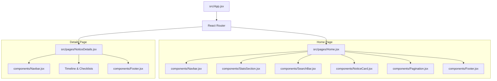

# 🎨 noice. Client — Frontend Dashboard

This directory houses the client-side single-page application (SPA) for **noice.**, an AI-powered notice assistant. It connects to the Express API to fetch scraped notices and presents them in a highly interactive, responsive, and visually stunning dashboard interface.

---

## 💻 Frontend Tech Stack

* **Library:** [React 19](https://react.dev/) (utilizing Hooks like `useState`, `useEffect`, and `useRef` for optimal state management)
* **Build tool:** [Vite](https://vitejs.dev/) (leveraging Hot Module Replacement for near-instant development updates)
* **Styling Framework:** [Tailwind CSS v4](https://tailwindcss.com/) (using CSS custom properties via `@theme` to define consistent styling tokens)
* **Client Router:** [React Router v7](https://reactrouter.com/) (enabling seamless page transition between the dashboard and detail views)
* **Typography:** Premium Google Font pair:
  * **Playfair Display** (Serif) – elegant, classic look for editorial titles and notice headings.
  * **Plus Jakarta Sans** (Sans-serif) – modern geometric type for interface controls, metadata labels, and body copy.
* **API Fetching:** [Axios](https://axios-http.com/)

---

## 📐 Frontend Architecture & Components

The client application is structured around a modular component tree:



### 1. Key Components
* **[Navbar.jsx](file:///c:/Users/Harshita/Hello/OneDrive/Desktop/Noice/frontend/src/components/Navbar.jsx):** Glassmorphism style header with a blurred background backdrop filter. Houses the logo brand mark (`noice.`) and active status badge.
* **[StatsSection.jsx](file:///c:/Users/Harshita/Hello/OneDrive/Desktop/Noice/frontend/src/components/StatsSection.jsx):** Analytical KPI cards showing total analyzed notices, count of high priority notices, notice volume per category, and today's updates indicator.
* **[SearchBar.jsx](file:///c:/Users/Harshita/Hello/OneDrive/Desktop/Noice/frontend/src/components/SearchBar.jsx):** Controlled input component for real-time text matching.
* **[NoticeCard.jsx](file:///c:/Users/Harshita/Hello/OneDrive/Desktop/Noice/frontend/src/components/NoticeCard.jsx):** Renders individual notices, including priority badges, category chips, an excerpt summary, date details, and a click-through transition link.
* **[Pagination.jsx](file:///c:/Users/Harshita/Hello/OneDrive/Desktop/Noice/frontend/src/components/Pagination.jsx):** Clean page controls to limit dashboard density (default: 9 notices per page).
* **[Footer.jsx](file:///c:/Users/Harshita/Hello/OneDrive/Desktop/Noice/frontend/src/components/Footer.jsx):** Styled bottom row displaying branding copyrights and technologic stack icons.

---

## 🔍 Core Logic & State Management

### Dynamic Client-Side Sorting
To select how notices are shown, state controls sorted arrays in real-time. In [Home.jsx](file:///c:/Users/Harshita/Hello/OneDrive/Desktop/Noice/frontend/src/pages/Home.jsx), the `sortBy` state variable alternates between `"date"` and `"priority"`:

1. **Date of Notice (Newest First):** Converts string dates formatted as `DD-MM-YYYY` (e.g. `18-06-2026`) into JS Date instances for strict chronological sorting.
2. **Priority (High to Low):** Assigns numeric weights to priorities (`High` = 3, `Medium` = 2, `Low` = 1) to arrange critical alerts first, sub-sorting items with the same priority by notice date.

```javascript
const sortedNotices = [...filtered].sort((a, b) => {
  if (sortBy === "priority") {
    const priorityOrder = { High: 3, Medium: 2, Low: 1 };
    const weightA = priorityOrder[a.priority] || 0;
    const weightB = priorityOrder[b.priority] || 0;
    if (weightB !== weightA) return weightB - weightA;
  }
  const dateA = parseNoticeDate(a.date || a.createdAt);
  const dateB = parseNoticeDate(b.date || b.createdAt);
  return dateB - dateA;
});
```

---

## 🏃 Local Setup & Run Commands

Ensure that you have installed the root backend server and configured `.env` file first.

1. **Install Dependencies:**
   ```bash
   npm install
   ```

2. **Run Development Server:**
   ```bash
   npm run dev
   ```
   The application will launch on your local host (usually [http://localhost:5173](http://localhost:5173)).

3. **Build Production Assets:**
   ```bash
   npm run build
   ```

---

## 🔗 Related Resources
* Refer to the root [README.md](file:///c:/Users/Harshita/Hello/OneDrive/Desktop/Noice/README.md) for details on the backend Express API, MongoDB connection configurations, Cheerio scraper script, and Gemini AI processing.
